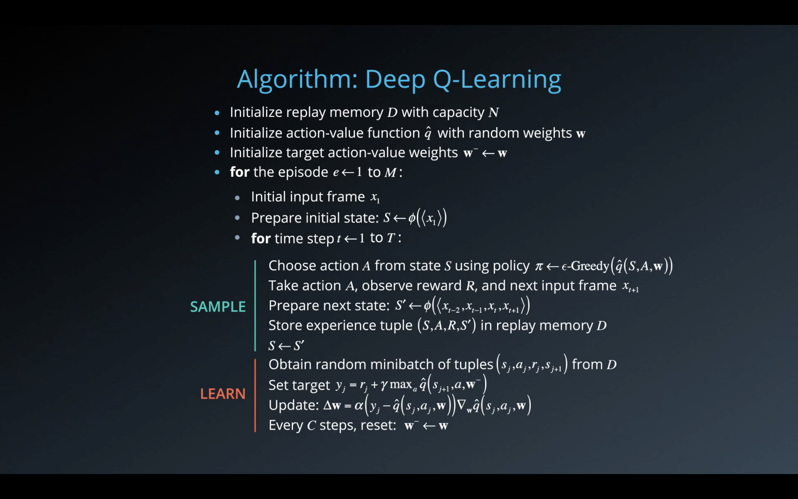
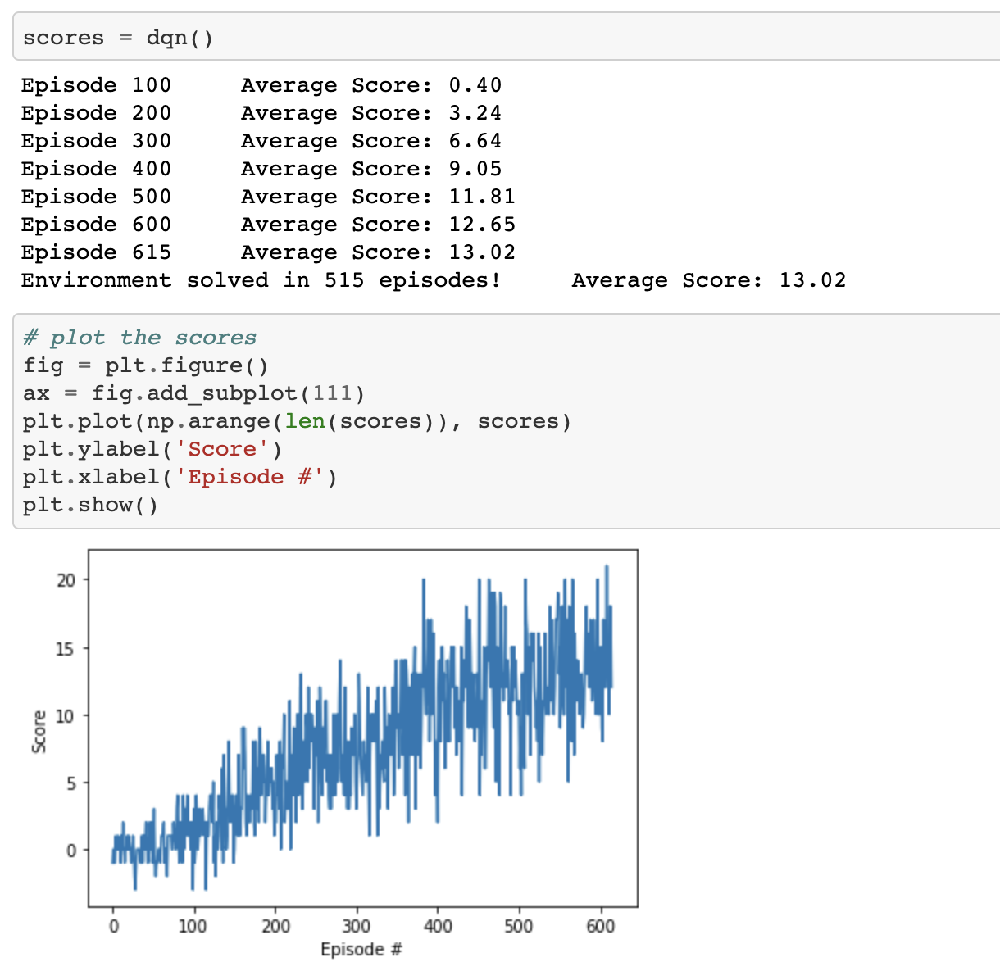

# Project Implemetation

### Model Algorithm

- This project implements a Value Based method called Deep Q-Network (DQN). 

- The DQN architecture is composed of a couple of fully connected layers. 

- The DQN takes the state  of the environment as input, and returns the corresponding predicted action values for each possible actions available.

- This learning algorithm utilized the 2 major training improvements to the DQN algorithm: 
  - Experience Replay
  - Fixed Q Targets



### Code Implementation

- The code used to solve this environment is taken from the solution to the [Lunar Lander](https://github.com/arbwasisi/deep-reinforcement-learning/tree/master/dqn/solution) code exercise. 

- Inside the `model.py` file is the `QNetwork` class that builds the agent and initializes its parameters. This is a regular fully connected Deep Neural Network with 2 hidden layers and 254 hidden units.

- The `dqn_agent.py` file contains the `Agent` class which initialize the agents and handles its learning process. While the `ReplayBuffer` class implements a fixed-size buffer to store experience tuples (state, action, reward, next_state, done).

- Final, the `Navigation.ipynb` is a jupyter notebook where we can train and test our agent and plot the results.

### Results and Hyperparameters

These were the hyperparameters used for the model:

```
BUFFER_SIZE = int(1e5)  # replay buffer size
BATCH_SIZE = 64         # minibatch size
GAMMA = 0.99            # discount factor
TAU = 1e-3              # for soft update of target parameters
LR = 5e-4               # learning rate 
UPDATE_EVERY = 4        # how often to update the network
```

This image represents the results of the model in solving the environment.



The environment, as shown in the image, is solved on the 615th episode with a score of 13.02.

### Ideas for Future Work

They're many implementation of the DQN that improves its overall performance. This includes the double DQN, dueling DQN and prioritized experience replay DQN. In total they're up to six different extension the DQN algorithms all with the aim of improving the algorithm for better performance. 

Researchers at Google's DeepMind have tested an agent using a combination of all six of these algorithm to compare its performance against the other algorithm. They called it the Rainbow DQN. It so happens that the Rainbow DQN outperformed the other six DQN algorithms on Atari's 2600 games. 

For a future implementation of my model, it would involve implenting the Rainbow DQN algorithm to test whether such an algorithm would improve the performance of my agent.
