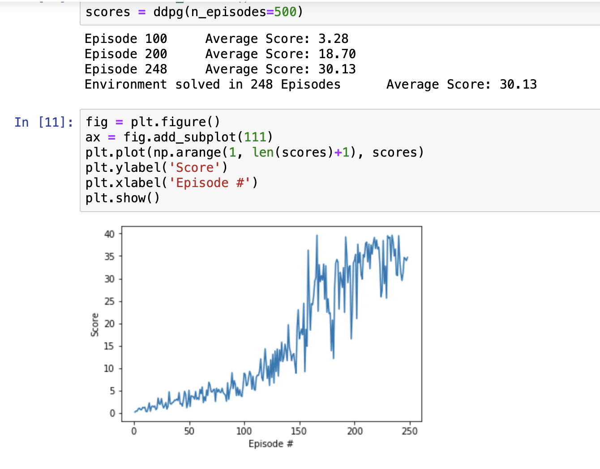

# Project Implemetation

### Model Algorithm

- This project implements an actor-critic method called Deep Deterministic Policy Gradiant Network (DDPG). 

- The DDPG architecture is composed of two networks, the actor network and the critic network. 

- The actor takes the state of the environment as input, and formulate a deterministic policy.
- The critic evaluates the actors policy by using it to approximate the Q function.

- This learning algorithm utilizes several techniques from the DQN algorithm such as replay buffers and fixed 
  target networks, as well as new techniques including: 
  - Soft updates
  - Ornstein-Uhlenbeck noise

### Code Implementation

- The code used to solve this environment is taken from the solution to the [Pendulum](https://github.com/arbwasisi/deep-reinforcement-learning/tree/master/ddpg-pendulum) code exercise. 

- Inside the `model.py` file is the `Actor` and `Critic` classes that builds the agents and initializes their parameters. This is a regular fully connected Deep Neural Network with 2 hidden layers and 254 hidden units.

- The `dqn_agent.py` file contains the `Agent` class which initialize the agents and handles its learning process. The `ReplayBuffer` class implements a fixed-size buffer to store experience tuples (state, action, reward, next_state, done).

- Final, the `Continuous_Control.ipynb` is a jupyter notebook where we can train and test our agent and plot the results.

### Results and Hyperparameters

These were the hyperparameters used for the model:

```
BUFFER_SIZE = int(1e5)  # replay buffer size
BATCH_SIZE = 128        # minibatch size
GAMMA = 0.99            # discount factor
TAU = 1e-3              # for soft update of target parameters
LR_ACTOR = 1e-4         # learning rate of the actor 
LR_CRITIC = 1e-4        # learning rate of the critic
WEIGHT_DECAY = 0        # L2 weight decay
```

This image represents the results of the model in solving the environment.



The environment, as shown in the image, is solved on the 248th episode with a score of 30.13.

### Ideas for Future Work

For future solutions, I would utilize the more recent and advanced Distributed Distributional Deterministic Policy Gradients (D4PG) to solve the environment
and test it against the regular DDPG algorithm that I used for this project. I would also like to tackle the the environment with multiple agents as opposed to 
just one.
