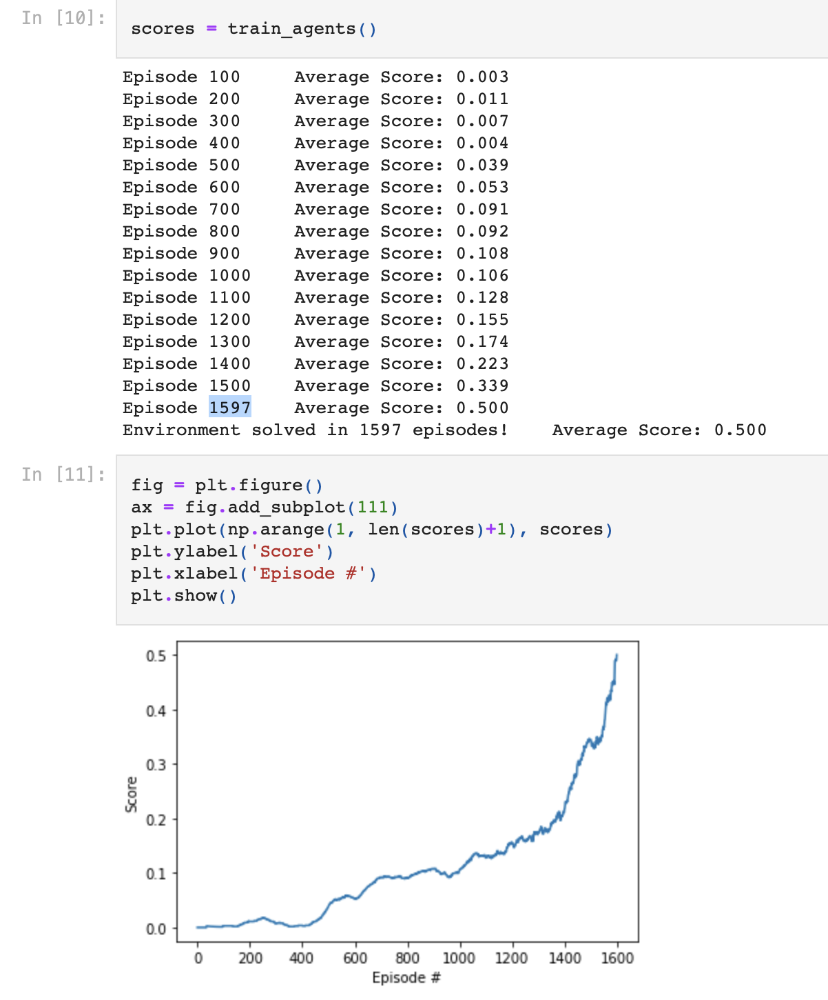

# Project Implemetation

### Model Algorithm

- This project extends on the DDPG algorithm for multiple agent environment. It uses a Multi-Agent DDPG(MADDPG). 

- The MADDPG algorithm uses a centralized training technique where all agent are equipped with the same critic.
  This adds extra information of the environment that the agents wouldn't have, preventing the non-stationarity problem in MARL.
  
- The execution however, is decentralized. Thus the central critic is removed and only the actors are use for testing. This is so
  the agents don't overfit each others policies.

### Code Implementation

- The code used to solve this environment is an extention of the code from the continous control project.

- Inside the `model.py` file is the `Actor` and `Critic` classes that builds the agents and initializes their parameters.
  This is a regular fully connected Deep Neural Network with 2 hidden layers and 254 hidden units.

- The `ddpg_agent.py` file contains the `Agent` class which initialize the agents and handles its learning process.
  The `ReplayBuffer` class implements a fixed-size buffer to store experience tuples (state, action, reward, next_state, done).
  The `OUNoise` class adds noise to the training process to encourage exlporation during training.

- Final, the `Tennis.ipynb` is a jupyter notebook where we can train and test our agent and plot the results.

### Results and Hyperparameters

These were the hyperparameters used for the model:

```
BUFFER_SIZE = int(1e5)  # replay buffer size
BATCH_SIZE = 128        # minibatch size
GAMMA = 0.99            # discount factor
TAU = 1e-3              # for soft update of target parameters
LR_ACTOR = 1e-4         # learning rate of the actor 
LR_CRITIC = 2e-4        # learning rate of the critic
WEIGHT_DECAY = 0        # L2 weight decay
```

This image represents the results of the model in solving the environment.



The environment, as shown in the image, is solved on the 1597th episode with a score of 0.5.

### Ideas for Future Work

For future solutions, I would incoporate the concept of policy ensembles. This is a concept discussed in [This MADDPG](https://arxiv.org/pdf/1706.02275.pdf) paper.
This method approximates agents policies rather than have agents know each others policies without inferring. This is taken a step further to prevent overfitting
by having a collection of K sub-policies for each agent to execute. In addition, adding prioritized replay to the algorithm would help decrease bias and correlations when training the agents with the replay buffer. Finally, a different approach to the project would be using the D4PG algorithm and extend it for MARL
environment, and compare its performance to the MADDPG algorithm.
